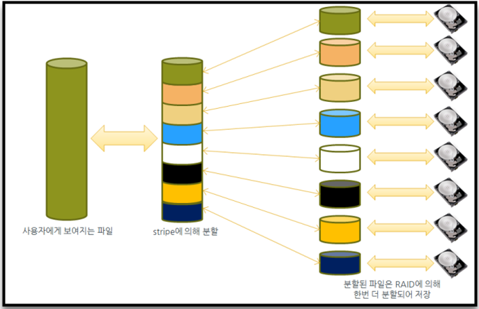

# Method for Using Lustre Stripe

## A. Basic Settings for the Unit# 5 Lustre Striping

The Unit #5 Lustre file system supports file striping. For this purpose, a single file was distributed and stored in multiple object storage targets (OST)—that is, several disks that are physically distributed. As a result, it was possible to reduce bottlenecks and improve the I/O performance. In particular, the progressive file layout (PFL), which is supported from Lustre 2.10, is applied to the /scratch file system. This function automatically applies the number of stripe counts according to the file size without the user's separate striping setting, thereby improving the I/O performance. The striping settings of the Nurion file system are as follows:


## B. Lustre Striping Concept



Lustre partitions data for each OST to maximize the I/O performance for large files. The maximum number of partitions for which parallelization is valid is equal to the OST number. A single file is also stored in the OST in parallel using the Lustre striping function, as shown in the figure above.

## C. Stripe Settings and Verification

```
$ lfs setstripe [--stripe-size|-s size] [--stripe-count|-c count] filename|dirname
```

\- The command to apply the striping settings to a file or directory. The striping settings are applied to the files created using the above command or all files created in the directory to which the above command is applied.

ㅇ --stripe-size

ㆍ Sets the size of the data to be stored in each OST.

ㆍStores data in the next OST when the data of the specified size have been stored.

ㆍThe default value is 1 MB, and the default value is used if stripe\_size is set to 0. stripe\_size must be a multiple of 64 KB, and it needs to be less than 4 GB.

ㅇ --stripe-count

ㆍSets the number of OSTs to be used in striping.

ㆍThe default value is 1, and the default value is used if stripe\_count is set to 0.

ㆍUse all possible OSTs if stripe\_count is -1.

```
$ lfs getstripe filename|dirname
```

\- The command to check the values of the striping settings that have been applied to a file or directory.

## D. Recommended Guidelines and Tips

ㅇ If setstripe is specified in the job script for the directory where the result file of the model will be saved, all subdirectories and files that are subsequently created inherit this setting value.

ㅇ When --stripe-count is set to 4 for files larger than or equal to 1 GB, performance is enhanced in most cases. If a larger value is used, it needs to be tested.

ㅇ As --stripe-size is only valid when the file size is several TB or larger, it is okay to use the default value in most cases.


2022년 2월 15일에 마지막으로 업데이트되었습니다.

