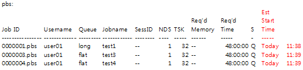

# Job Execution through Scheduler (PBS)

The job scheduler of the 5th supercomputer Nurion uses a portable batch system (PBS). In this chapter, a method for submitting jobs through a scheduler and the related commands are introduced. The queues for users to submit jobs are already determined. The maximum number of jobs that a user can submit per queue is limited, which can be adjusted depending on the load of the system.

Nurion employs an **exclusive node allocation policy** as the default to ensure that only the jobs of one user are executed in one node. It prevents significant performance degradation of the user application, which can occur when the shared node allocation policy is applied. However, queues that cannot use commercial SW are applied with the shared node policy to ensure efficient use of resources because the node scale is relatively small.

A user’s job can only be submitted through the login node, and general users cannot directly access the computing node.

Moreover, **user jobs can only be submitted in /scratch**.

## A. Queue Configuration

ㅇ The commercial queue (for executing commercial SW) and the debug queue for debugging are applied with the shared node policy, where multiple jobs are assigned per node within the range of available resources (CPU core); only one job is assigned to one node in the remaining queues according to the exclusive node policy.

ㅇ Job queue

\- The queues that can be used by general users and the number of jobs that can be submitted per user are presented in the following table. (as of April 2021)


**※ Node configuration can be adjusted while the system is in operation depending on the system loads.** (The node configuration and maximum number of jobs allowed can be checked frequently through showq command and motd)

① Queue description


② Limited number of job submissions

\- Maximum no. of job submissions per user : Error occurs at the time of submission if the number of allowed submissions is exceeded

\- Maximum no. of job executions per user : Previous job needs to be completed first if the number of allowed submissions is exceeded

③ Limited resource occupancy

\- No. of occupied nodes per job (max|min) : Error occurs at the time of submission if the number of occupied nodes in a single job exceeds the min. and max. range. It is not associated with the number of occupied nodes of jobs being executed or queued.

④ Distinguishing queues according to the KNL memory queue (all cluster modes are quadrant)

\- exclusive, normal, long, and debug queues are set in the cache mode (MCDRAM is used as the L3 cache), while the flat queue is set in the flat mode (MCDRAM is used as RAM along with DDR4).

\- The cache mode has a maximum available memory of 82 GB, whereas the flat mode has 102 GB for protecting the system.

⑤ By setting hyperthread as off, up to 68 threads per node can be used for KNL, and up to 40 threads per node can be used for SKL.

## B. Job Submission and Monitoring

#### 1) Batch job submission

ㅇ Writing a job script and an example

Refer to the required keywords and **job script sample** shown below and Annex 1 **Job script keywords** when writing and submitting a job script. An example of a job script file can be found in **/apps/shell/home/job\_examples**.

※ Required option for PBS job scheduler

| **Required option** | **Description**                                       |
| ------------------- | ----------------------------------------------------- |
| #PBS –V             | Maintains current environment variables               |
| #PBS –N             | Sets the job name                                     |
| #PBS –q             | Queue for executing a job                             |
| #PBS –l             | Sets the resources to be used in a job                |
| #PBS –A             | Information of the used program (statistical purpose) |

※ Variable keyword for resource allocation

Designate the resources to be used with keywords such as select, ncpus, ompthreads, miprocs, and walltime

| **Keyword** | **Description**                                                                    |
| ----------- | ---------------------------------------------------------------------------------- |
| select      | No. of nodes to be used                                                            |
| ncpus       | <p>No. of CPUs to be used</p><p>(≥ no. of processes per node * no. of threads)</p> |
| mpiprocs    | No. of processes per node to be used                                               |
| ompthreads  | No. of OMP threads to be used                                                      |
| walltime    | Job execution time                                                                 |

**※ For the purpose of collecting data to increase the convenience of Nurion users, drafting the information of the program being used through PBS options has become mandatory, as shown below. In other words, the -A option of PBS must be included in the application based on the table below when submitting a job. (since April 2019)**

**※ Adding an application is handled according to the user demand collected periodically. If necessary, please make an additional request for the respective application to** [**consult@ksc.re.kr**](mailto:consult@ksc.re.kr)**.**

**\[PBS option names per application]**

| **Application type** | **PBS option name**              | **Application type** | **PBS option name** |
| -------------------- | -------------------------------- | -------------------- | ------------------- |
| ANSYS (CFX, Fluent)  | **ansys**                        | VASP                 | **vasp**            |
| Abaqus               | **abaqus**                       | Gromacs              | **gromacs**         |
| Nastran              | **nastran**                      | Amber                | **amber**           |
| Gaussian             | **gaussian**                     | LAMMPS               | **lammps**          |
| OpenFoam             | **openfoam**                     | NAMD                 | **namd**            |
| WRF                  | **wrf**                          | Quantum Espresso     | **qe**              |
| CESM (including CAM) | **cesm**                         | QMCpack              | **qmc**             |
| MPAS                 | **mpas**                         | BWA                  | **bwa**             |
| ROMs                 | **roms**                         | SIESTA               | **siesta**          |
| MOM                  | **mom**                          | in-house code        | **inhouse**         |
| TensorFlow           | **tf**                           | Caffe                | **caffe**           |
| PyTorch              | **pytorch**                      | Qchem                | **qchem**           |
| grims                | **grims**                        | RAMSES               | **ramses**          |
| cp2k                 | **cp2k**                         | Charmm               | **charmm**          |
| Other applications   | <p><strong>etc.</strong><br></p> |                      |                     |

(e.g.: For VASP users, add #PBS -A vasp to a PBS program job script)

※ Environment variables

| **Environment variable** | **Description**                                                     |
| ------------------------ | ------------------------------------------------------------------- |
| PBS\_JOBID               | Identifier allocated to a job                                       |
| PBS\_JOBNAME             | Job name provided to a user                                         |
| PBS\_NODEFILE            | File name containing the list of computing nodes allocated to a job |
| PBS\_O\_PATH             | Path value of a submission environment                              |
| PBS\_O\_WORKDIR          | Absolute path location where qsub is executed                       |
| TMPDIR                   | Temporary directory designated for a job                            |

To execute a batch job in PBS, the PBS keywords explained above must be used when writing a job script file.

※ A job submission script sample file can be copied from /apps/shell/home/job\_examples to be used.

#### ■ Example of serial program job script (serial.sh)

```
#!/bin/sh#PBS -N serial_job#PBS -V#PBS -q normal
 #PBS -A {PBS option name}  # refer to the table of PBS option name per application#PBS -l select=1:ncpus=1:mpiprocs=1:ompthreads=1#PBS -l walltime=04:00:00
 #PBS -m abe  # job email notification option
 #PBS -M abc@def.com  # recipient email address cd $PBS_O_WORKDIR
 module purge
 module load craype-mic-knl
 
 ./test.exe
```

※ Example of 1 node allocated and serial use

※ When #PBS –m and #PBS –M options are used to submit a job as shown in the example above, emails are sent to abc@def.com when a job is executed, completed, or halted

#### ■ Example of an OpenMP program job script (openmp.sh)

```
#!/bin/sh#PBS -N openmp_job#PBS -V#PBS -q normal
 #PBS -A {PBS option name}  # refer to the table of PBS option name per application#PBS -l select=1:ncpus=64:mpiprocs=1:ompthread=64#PBS -l walltime=04:00:00 cd $PBS_O_WORKDIR
 module purge
 module load craype-mic-knl
 
 ./test_omp.exe
```

※ Example of 1 node occupied and 64 threads (total of 64 OpenMP threads) being used per node

#### ■ Example of an MPI (IntelMPI) program job script (mpi.sh)

```
#!/bin/sh#PBS -N IntelMPI_job#PBS -V#PBS -q normal
 #PBS -A {PBS option name}  # refer to the table of PBS option name per application#PBS -l select=4:ncpus=64:mpiprocs=64#PBS -l walltime=04:00:00 cd $PBS_O_WORKDIR
 module purge
 module load craype-mic-knl intel/18.0.3 impi/18.0.3
 
 mpirun ./test_mpi.exe
```

※ Example of four nodes occupied and 64 processes (total of 256 MPI processes) being used per node

#### ■ Example of an MPI (OpenMPI) program job script (mpi.sh)

```
#!/bin/sh#PBS -N OpenMPI_job#PBS -V#PBS -q normal
 #PBS -A {PBS option name}  # refer to the table of PBS option name per application#PBS -l select=4:ncpus=64:mpiprocs=64#PBS -l walltime=04:00:00 cd $PBS_O_WORKDIR
 module purge
 module load craype-mic-knl gcc/7.2.0 openmpi/3.1.0
 
 mpirun ./test_mpi.exe
```

※ Example of four nodes occupied and 64 processes (total of 256 MPI processes) being used per node

#### ■ Example of an MPI (Mvapich2) program job script (mpi\_mvapich2.sh)

```
#!/bin/sh#PBS -N mvapich2_job#PBS -V#PBS -q normal
 #PBS -A {PBS option name}  # refer to the table of PBS option name per application#PBS -l select=4:ncpus=64:mpiprocs=64:ompthread=1#PBS -l walltime=04:00:00 cd $PBS_O_WORKDIR
 
 module purge
 module load craype-mic-knl intel/18.0.3 mvapich2/2.3.1
 
 TOTAL_CPUS=$(wc -l $PBS_NODEFILE | awk '{print $1}')
 
 mpirun_rsh -np ${TOTAL_CPUS} -hostfile $PBS_NODEFILE ./test_mpi.exe
```

※ Example of four nodes occupied and 64 processes (total of 256 MPI processes) being used per node

#### ■ Example of a hybrid (IntelMPI + OpenMP) program job script (hybrid\_intel.sh)

```
#!/bin/sh#PBS -N hybrid_job#PBS -V#PBS -q normal
 #PBS -A {PBS option name}  # refer to the table of PBS option name per application#PBS -l select=4:ncpus=64:mpiprocs=2:ompthread=32#PBS -l walltime=04:00:00 cd $PBS_O_WORKDIR
 
 module purge
 module load craype-mic-knl intel/18.0.3 impi/18.0.3 mpirun ./test_mpi.exe
```

※ Example of four nodes occupied, two processes per node, and 32 threads per process (total of eight MPI processes and 256 OpenMP threads) being used

#### ■ Example of a hybrid (openMPI + OpenMP) program job script (hybrid\_openmpi.sh)

```
#!/bin/sh#PBS -N hybrid_job#PBS -V#PBS -q normal
 #PBS -A {PBS option name}  # refer to the table of PBS option name per application#PBS -l select=4:ncpus=64:mpiprocs=2:ompthread=32#PBS -l walltime=04:00:00 cd $PBS_O_WORKDIR
 
 module purge
 module load craype-mic-knl gcc/7.2.0 openmpi/3.1.0 mpirun --map-by NUMA:PE=34 ./test_mpi.exe
```

※ Example of four nodes occupied, two processes per node and 32 threads per process (total of eight MPI processes and 256 OpenMP threads) being used

#### ■ Example of a hybrid (Mvapich2 + OpenMP) program job script (hybrid\_mvapich2.sh)

```
#!/bin/sh#PBS -N hybrid_job#PBS -V#PBS -q normal
 #PBS -A {PBS option name}  # refer to the table of PBS option name per application#PBS -l select=4:ncpus=64:mpiprocs=2:ompthread=32#PBS -l walltime=04:00:00 cd $PBS_O_WORKDIR
 
 module purge
 module load craype-mic-knl intel/18.0.3 mvapich2/2.3.1
 TOTAL_CPUS=$(wc -l $PBS_NODEFILE | awk '{print $1}')
 
 mpirun_rsh -np ${TOTAL_CPUS} -hostfile $PBS_NODEFILE 
 OMP_NUM_THREADS=$OMP_NUM_THREADS ./test_mpi.exe
```

※ Example of four nodes occupied, two processes per node, and 32 threads per process (total of eight MPI processes and 256 OpenMP threads) being used

ㅇ Example of submitting a written job script

```
$ qsub mpi.sh
```

※ Based on the mpi.sh file as an example, submit a job using the written job script file.

ㅇ When executing a PBS batch job, STDOUT (standard output) and STDERR (standard error) during a job are saved in the output of the system directory and then copied to a user’s job submission directory once the job is completed. Fundamentally, details related to a job cannot be checked until the job is completed, but the details can be checked if the next keyword is added.

ㅇ Keyword for checking STDOUT/STDERR generated by PBS during job execution (generated in the /home01 file)

```
#PBS -W sandbox=PRIVATE
```

ㅇ Checking job execution using the Redirection feature of Linux

```
./test.exe 1>stdout 2>stderr
```

ㅇ Designating email notifications for a job

```
$ qsub -m -M   
ex) qsub -m abe -M abc@def.com hello_world.sh
```

| **Option** | **Description**                      |
| ---------- | ------------------------------------ |
| a          | When a job is halted (default value) |
| b          | When a job has started               |
| e          | When a job has been completed        |
| n          | Do not receive email notifications   |

#### 2) Submitting interactive jobs

※ Unlike writing a job script, #PBS is omitted and only the –I –A option is used for submitting interactive jobs

**※ When idle for at least two hours, a job ends from timeout and resources are retrieved; the walltime of interactive jobs is fixed at 12 h at the maximum**

ㅇ Using the “-I” option instead of a batch script

```
$ qsub -I -l select=1:ncpus=68:ompthreads=1 -l walltime=12:00:00 -q normal 
-A {PBS option name}
```

ㅇ Using graphic environment when submitting interactive jobs (-X)

```
$ qsub -I -X -l select=1:ncpus=68:ompthreads=1 -l walltime=12:00:00 -q normal -A {PBS option name}
```

※ Here, phrases -l select or below can be used by changing according to the user demands, but the above phrases (resource occupancy, queue name, and PBS option name) must be included when submitting a job

ㅇ Inheriting existing environment variables when submitting interactive jobs (-V)

```
$ qsub -I -V -l select=1:ncpus=68:ompthreads=1 -l walltime=12:00:00 -q normal -A {PBS option name}
```

※ It is recommended to perform debugging by submitting interactive jobs without providing a debug node.

※ Pay attention to the lower and upper cases of “I” in the above example

#### ■ Example of executing a TensorFlow program in a computing node in interactive mode

```
$ qsub -I -V -l select=1:ncpus=68:ompthreads=68 \-l walltime=12:00:00 -q normal -A tf
$ export OMP_NUM_THREADS=68;singularity exec tensorflow-1.12.0-py3.simg python convolutional.py
```

※ Location of example singularity image file: /apps/applications/tensorflow/1.12.0/tensorflow-1.12.0-py3.simg

Location of example convolutional.py: /apps/applications/tensorflow/1.12.0/examples/convolutional.py

\- It is recommended to copy the above files to the user directory being tested.

#### 3) Job monitoring

※ Commands related to job monitoring can only be used in the login node.

ㅇ Queue inquiry

```
$ showq
```

ㅇ Inquiring unused resources of a node per queue

```
$ pbs_status
```

ㅇ Inquiring a queue list that can be used by the current account

```
$ pbs_queue_check
```

ㅇ Checking the job status

| **Option** | **Description**                                     |
| ---------- | --------------------------------------------------- |
| qstat -u   | Inquiry only on the user’s jobs                     |
| qstat -T   | Inquire remaining queue time of the jobs in Q state |
| qstat -i   | Inquire only jobs in Q and H state                  |
| qstat -f   | Inquire job details                                 |
| qstat -x   | Inquire completed jobs                              |

$ qstat <-a, -n, -s, -H, -x, ...>\
ex> qstat\
Job id Name User Time Use S Queue\
0001.pbs test\_01 user01 8245:43: R normal\
0002.pbs test\_02 user02 8245:44: R flat\
0003.pbs test\_03 user03 7078:45 R norm\_skl\
0003.pbs test\_04 user04 1983:11: Q long

※ Job Id: Job number.pbs

Name: #PBS –N value of a job script

S: Shows the operation status of a job (R-running/ Q-queue/ H-halted/ E-error)

ㅇ Job attribute inquiry

```
$ qstat -f    
ex> qstat -f 0000
Job Id : 0000.pbs
   Job_Name = test
   Job_Owner = user@login01
   resources_used.cpupercent = 6416
   resources_used.cput = 8245:43:20
   resources_used.mem = 33154824kb
   resources_used.ncpus = 64
   resources_used.vmem = 999899940kb
   resources_used.walltime = 128:54:21
   job_state = R
```

ㅇ Job queue time inquiry (Estimated Start Time)

```
$ qstat -i -w -T -u 
```

※ Here, i is a flag showing the list of jobs in the H or Q state, whereas -w is a flag that outputs the detailed information horizontally (when using the -w flag, information can be easily seen if the terminal window is expanded lengthwise for arrangement)


```
$ qstat -i -w -T -u user01
```



※ Calculated estimation based on the collected walltime information of a user’s job script

## C. Job Control

ㅇ Deleting a job

$ qdel \[job\_id]

ㅇ Suspending/resuming a job

```
$ qsig -s 
```


2022년 2월 15일에 마지막으로 업데이트되었습니다.

