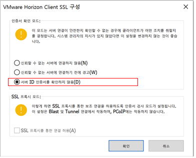
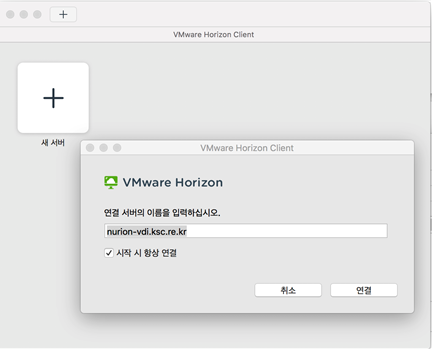
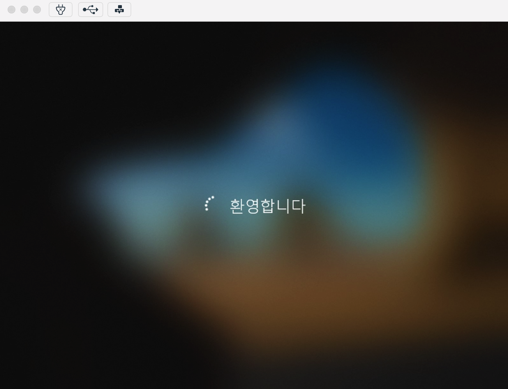
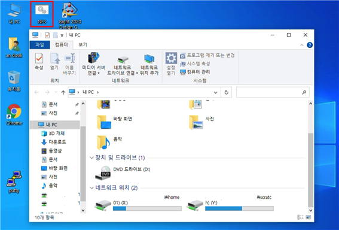

# Miscellaneous Manual

## A. Desktop Virtualization (VDI)

Desktop virtualization (VDI) is a remote desktop service for executing applications requiring high-performance graphic processing in a Windows environment. VDI is capable of pre- and post-processing of engineering interpretation in a virtual machine (VM) without transferring files by linking with the filesystem of Nurion. Interpretation (solving) is not supported in VMs; it can be executed in the Nurion system through terminal access programs (putty, etc.) within VMs.

For each of the eight VMs, 3.0 Ghz 4-core CPU, 32 GB memory, and 8 GB GPU memory are allocated . To support multiple users with a limited number of VMs, a user is automatically logged off when idle for two hours while connected to VMs.

Currently, Abaqus 2020 and Ansys 2020 R2 are supported as engineering interpretation applications. Supported applications will be expanded in the future depending on the user demand.

To use the VDI service, complete the application form below and send it to account@ksc.re.kr. A temporary password will be issued after approval by an administrator. The temporary password needs to be changed when accessing the VM for the first time, and it does not get linked with the Nurion password.

Errors or questions during use can be inquired by going to Contact menu on the KSC website (https://www.ksc.re.kr).

**ㅇ Application form for VDI service**

I would like to apply for the Nurion system VDI service.

\- Nurion ID :

\- Usage period :

\- Application to use :

**ㅇ How to access VM**

Download and install Horizon Client appropriate for a user’s environment from the website below to access VM.\
[https://my.vmware.com/en/web/vmware/downloads/info/slug/desktop\_end\_user\_computing/vmware\_horizon\_clients/horizon\_8](https://my.vmware.com/en/web/vmware/downloads/info/slug/desktop\_end\_user\_computing/vmware\_horizon\_clients/horizon\_8)

After installing Horizon Client, complete the settings as shown below.


Settings menu on the top right corner - SSL Configuration



Select “Do not check server ID certificate” and then click OK.



New Server - enter nurion-vdi.ksc.re.kr and then click Connect.


Enter the Nurion ID and OTP number to log in.


Enter the temporary VDI password issued by the administrator at the first access (the same ID as the Nurion system is used, but the password is different)



When accessing VM, image initialization and user profile creation require approximately 3 min



Once VM access is completed, home01 and scratch of the Nurion system are automatically mounted. The NFS of the desktop is executed when not mounted or an error occurs.\
The C:\ drive and control panel are blocked from access because of security reasons; a user is automatically logged off when idle for two hours

\\

## B. Singularity Container

Singularity is a container platform suitable for the HPC environment to implement the OS virtualization as a Docker. The Linux distribution version suitable for a user’s work environment, compiler, and container images containing library will be provided. The container is operated to execute a user program.


**ㅇ Loading singularity module**

```
$ module load singularity/3.6.4
```

**ㅇ Executing shell in singularity container**

```
$ singularity shell [image name] 
$ singularity shell tensorflow-1.12.0-py3.simgSingularity: Invoking an interactive shell within container... 

Singularity tensorflow-1.12.0-py3.simg:tensorflow>
```

**ㅇ Executing user program in singularity container**

```
$ singularity exec [image name] execution command 
$ singularity exec tensorflow-1.12.0-py3.simg python convolutional.py
```

_※ For executing containers through the scheduler (PBS) in a computing node, refer to the example in the guideline 'Job Submission through Scheduler (PBS)' B.-2) 'Submission of Interactive Jobs'_

_※ A convolutional model sample program (convolutional.py) and data directory (data) can be copied from the /apps/applications/tensorflow/1.12.0/examples directory to a user’s work directory to be tested._

| **Software (framework)** | **Container image file**                                          |
| ------------------------ | ----------------------------------------------------------------- |
| tensorflw 1.12.0         | /apps/applications/tensorflow/1.12.0/tensorflow-1.12.0-py3.simg   |
| tensorflw 1.13.1         | /apps/applications/singularity\_images/tensorflow-1.13.1-py3.simg |
| pytorch 1.2.0            | /apps/applications/singularity\_images/pytorch-1.2.0-py3.simg     |

**ㅇ For users to build a singularity container image without root permission**


```
$ singularity build --fakeroot ubuntu1.sif ubuntu.def (building ubuntu1.sif image from the recipe file)
$ singularity build --fakeroot ubuntu2.sif library://ubuntu:18.04 (building ubuntu2.sif image from the singularity library)
$ singularity build --fakeroot --sandbox ubuntu3 docker://ubuntu:18.04 (building sandbox directory (ubuntu3) from Docker Hub)
```


_※ It is supported in the 3.6.4 version; go to KISTI website > Technical Support > Inquiry to request the administrator to register for the use of fakeroot._\
_※ Root permission is required to adjust the generated singularity image file (\*.sif), and it needs to be converted into a sandbox (writable chroot directory)._


```
bootstrap: library
 from: ubuntu:18.04
 %post
 apt update
 %runscript
 echo "hello world from ubuntu container!"
```



```
 $ singularity build --remote ubuntu4.sif ubuntu.def 
 (Building ubuntu4.sif image from the recipe file using a remote build service provided by Sylabs Cloud)
```


_※ An access token needs to be generated and registered on Nurion to use a remote build service provided by Sylabs Cloud (https://cloud.sylabs.io) \[reference 1]_\
_※ Generating/managing a singularity container image is possible by accessing Sylabs Cloud on a web browser \[reference 2]_


```
$ singularity pull tensorflow.sif library://dxtr/default/hpc-tensorflow:0.1 (importing a container image from the Sylabs Cloud library)
$ singularity pull tensorflow.sif docker://tensorflow/tensorflow:latest (importing an image from Docker Hub and converting it into a singularity image)
$ singularity push -U tensorflow.sif library://ID/default/tensorflow.sif (exporting a singularity image to the Sylabs Cloud library (upload))
```


_※ An access token needs to be generated and registered on Nurion to export an image to Sylabs Cloud (https://cloud.sylabs.io) \[reference 1]_


**\[Reference 1] Generating a Sylabs Cloud access token and registering on Nurion**


**\[Reference 2] Building a singularity container image using a remote builder on a web browser**


_※ Includes a list of images remotely built with singularity commands in Nurion_

## C. Burst Buffer

**◦ Concept**

Burst buffer IME performs the role of a cache in the Nurion /scratch filesystem. The data access method through IME is as shown in the figure below.


IME is mounted on a client node (entire computing nodes and login node) using FUSE (**F**ile System In **USE**rspace) which is a user-level filesystem. A caution is needed to ensure the /scratch filesystem is mounted because IME serves the role of a cache. The IME directory path is **/scratch\_ime,** in which all directories and file structures of the scratch (/scratch/$USER) filesystem can be checked when the first user accesses the directory (/scratch\_ime/$USER). The data does not exist in the actual IME device, and the data is cached by IME in /scratch when a job is executed using the burst buffer. To use the IME, the burst buffer project name (#PBS -P burst\_buffer) needs to be clarified in the job script. There are two methods for executing an application.

① /scratch\_ime, which is the mount point of IME, is designated as the I/O directory where the existing POSIX-based I/O can be executed without compilation. A user can submit a job using the conventional method but needs to set the data I/O path at the bottom of /scratch\_ime/$USER/.

1. ex) INPUT="/scratch\_ime/$USER/input.dat", OUTPUT="/scratch\_ime/$USER/output.dat"

```
#!/bin/sh
 #PBS -N burstbuffer
 #PBS -V
 #PBS -q normal        # all queues can be used
 #PBS -A {PBS option name} # refer to the table of PBS option name per application
 #PBS -P burst_buffer  # must be clarified for using burst buffer
 #PBS -l select=2:ncpus=16:mpiprocs=16
 #PBS -l walltime=05:00:00
 
 cd $PBS_O_WORKDIR
 
 OUTFILE=/scratch_ime/$USER/output.dat 
 
  # write execution commands related to the job (refer to the example in Chapter 4 "Job Execution through Scheduler" Section B.)
```

② To use MPI-IO based I/O, the mvapich2/2.3.1 module that supports IME must be used. Application programs need to be compiled again using the MPI library. The file or directory path needs to be designated using the IME protocol as shown in the example below.

1. ex) OUTFILE=ime:///scratch/$USER/output.dat (refer to a sample job script below)

```
$ module load mvapich2/2.3.1
```

Load the mvapich2/2.3.1 module as above and write a job script as shown below.

```
#!/bin/sh
 #PBS -N mvapich2_ime
 #PBS -V
 #PBS -q normal            # all queues corresponding to KNL can be used (exclusive, normal, long, flat, debug)
 #PBS -A {PBS option name} # refer to the table of PBS option name per application
 #PBS -P burst_buffer     # Must be clarified for using burst buffer
 #PBS -l select=2:ncpus=16:mpiprocs=16
 #PBS -l walltime=5:00:00
 
 cd $PBS_O_WORKDIR
 TOTAL_CPUS=$(wc -l $PBS_NODEFILE | awk '{print $1}')
 OUTFILE=ime:///scratch/$USER/output.dat  
 mpirun_rsh -np ${TOTAL_CPUS} -hostfile $PBS_NODEFILE ./a.out 
 or
 mpirun -np ${TOTAL_CPUS} -hostfile $PBS_NODEFILE ./a.out 
```

\* Supported compiler: gcc/6.1.0, gcc/7.2.0, intel/17.0.5, intel/18.0.1, intel/18.0.3, intel/19.0.4, pgi/18.10

\* MPI-IO of IME is implemented using a separate ROMIO interface, but the ROMIO function that officially supports IME is included starting from the MVAPICH2/2.3.1 version. (OpenMPI is not supported)

\* Burst buffer IME can be used in all computing nodes of Nurion (SKL, KNL).

For the data management of IME, the life cycle of the data shown in the figure below needs to be examined. IME data processing largely consists of prestage, prefetch, sync, and release steps, where IME-API(#ime-ctl) commands for each step are provided.

 사용법(1).png>)

| ime-ctl -i $INPUT\_FILE  | <p>Stage-in is executed for the job data with IME</p><p>(Data caching from /scratch to /scratch_ime)</p>            |
| ------------------------ | ------------------------------------------------------------------------------------------------------------------- |
| ime-ctl -r $OUTPUT\_FILE | <p>IME data is synchronized with the parallel filesystem<br>(data is transferred from /scratch_ime to /scratch)</p> |
| ime-ctl -p $TMP\_FILE    | <p>Purge data in IME</p><p>(Purge the data in /scratch_ime)</p>                                                     |
| ime-ctl -s $FILE         | Provides status information of the IME data                                                                         |

Detailed options can be checked through \* #ime-ctl --help

**◦ Data processing**

The total capacity of IME is approximately 900 TB, which is automatically flushed in the /scratch filesystel or deleted according to the usage. In IME, a cache space is automatically secured according to the two threshold settings below:

① When the total capacity of newly created data (Dirty Data) is 45% or higher

② When the overall available space is 15% or below


**◦ Caution**

During the initial job execution, IME involves a step of caching the PFS data to the IME device and a load of flushing or synchronizing the cache data back into the PFS. Therefore, performance improvement can be expected for a massive amount of small I/O, which is relatively vulnerable in PFS (Lustre) and for applications with frequent checkpointing or high I/O execution frequency.

Moreover, IME (approximately 0.9 PB) has a relatively small capacity because it is used as a PFS cache (approximately 20 PB). Hence, data must be carefully managed because it can be deleted from a cache according to the threshold settings if the IME capacity becomes full during use.

**※ Caution: The given IME-API command must be used to delete the data that has been cached in the IME. Caution is especially necessary when the rm command is used to delete data from /scratch\_ime because the data saved in the actual /scratch is deleted.**

## D. Flat Node

◦ The node that supports the flat mode for which MCDRAM (16GB) and DDR4 can be used together among Nurion KNL nodes is provided to general users. To use this particular node, a job must be submitted by designating a flat queue.

◦ The “**numactl**” command must be used to apply the flat mode, which is a command for specifying the preferred or default memory mode. For example, when executing a file named “my\_app.x” in a flat mode, the numactl command and NUMA node corresponding to the “-m” option can be clarified together; however, if executing my\_app.x requires an MCDRAM of 16 GB or higher, the program is terminated owing to lack of memory. Therefore, it is recommended to use a method that ensures the program is not terminated when a user’s execution file requires 16 GB of memory or higher by using the **“-p”** option, which ensures that MCDRAM is **primarily** **used**.

\*\*\*\*

#### ■ **Example of a flat mode job script**

```
#!/bin/sh
#PBS -N flat_job
#PBS -V#PBS -q flat
#PBS -A {PBS option name} # refer to the table of PBS option name per application
#PBS -l select=1:ncpus=68:mpiprocs=32:ompthreads=1
#PBS -l walltime=12:00:00 

cd $PBS_O_WORKDIR 

mpirun numactl -m 1 my_app.x
or
mpirun numactl -p 1 my_app.x
```

※ Flat must be selected for the queue being submitted with the PBS option (i.e., -q flat)


2022년 2월 15일에 마지막으로 업데이트되었습니다.

