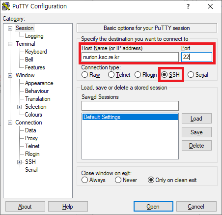
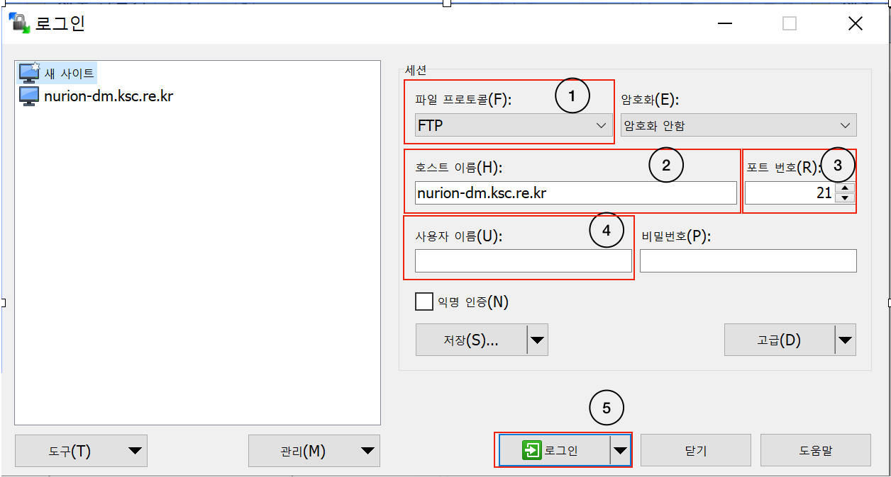

# User Environment

## A. Account Creation

① Researchers that have been approved to use the Nurion system should access the KISTI website ([**https://www.ksc.re.kr**](https://www.ksc.re.kr/)) to apply for an account.

◦ How to apply : Access the KISTI website, (top) Application for use -> (top) Apply -> Select application

\- Free account : Nurion system innovative support program, new users of the 5th supercomputer

\- Paid account : General and student users of the 5th supercomputer

\- Once an account has been created, information related to the account will be sent to the email listed on the application.

② Request for OTP (One Time Password) authentication code

**Based on the account information email you have received,** send an email to [account@ksc.re.kr](mailto:account@ksc.re.kr) by referring to the example below to receive an authentication code.

.png>)

③ Installing OTP application

\- The OTP smartphone application is provided for secured access to the supercomputer.

\- For the OTP smartphone application, search for “Any OTP” on Google Play or App Store and install the application developed by Mirae-tech.

\- When logging into the supercomputer, the OTP security code of the “Any OTP” application must be entered.

※ If you do not use a smartphone, please consult the account manager (account@ksc.re.kr).

※ Refer to the “OTP User Manual” by accessing the KISTI website > Technical Support > Guidelines for more details on OTP installation and use

※ Emails will be sent out for users on the LG U+ network because text messages are processed as spam on this network

## B. Login

\- Users can gain access through the login node (nurion.ksc.re.kr) of the Nurion system (refer to the node configuration below).

\- Default character set (encoding) is in unicode (UTF-8).

\- Only SSH, SCP, SFTP, and X11 are allowed to access the login node.

① Unix or Linux environment

```
$ ssh -l nurion.ksc.re.kr [-p 22]
```

e.g.) When user ID is x123abc

```
$ ssh -l x123abc nurion.ksc.re.kr 
or 
$ ssh -l x123abc nurion.ksc.re.kr -p 22
```

② Windows environment

\- Run Xming to execute the X environment

※ Download the program for free from the internet and install it.


\- Use ssh access programs such as putty or SSH Secure Shell Client

※ Programs can be downloaded for free from the internet.

※ Host Name : nurion.ksc.re.kr, Port : 22, Connection type : SSH



※ ssh -> X11 tap -> check "Enable X11 forwarding"

※ X display location : localhost:0.0


※ If the system cannot be accessed because of a DNS caching problem, clear all cache (run ipconfig/flushdns in command prompt) and access again.

```
C: ipconfig /flushdns
```

③ Sending/receiving files

\- Access the Datamover node (nurion-dm.ksc.re.kr) through an FTP client to send/receive files (refer to the node configuration below).

```
$ ftp nurion-dm.ksc.re.kr 
or 
$ sftp [user ID@]nurion-dm.ksc.re.kr [-p 22]
```

\- In the Windows environment, use FTP/SFTP client programs such as WinSCP that are distributed for free to access the system.



\* File Transfer Protocol (FTP) is used, where files can be sent without entering the OTP

\* Secure-FTP (SFTP) is used, where the OTP must be entered when sending files (safer than FTP).

④ Node configuration

.png>)

## C. Changing User Shell

\- BASH is provided as the default shell for the login node of the Nurion system. The chsh command is used for changing to a different shell.

```
$ chsh
```

\- echo $SHELL is used for checking the currently used shell.

```
$ echo $SHELL
```

\- Change the configuration files (.bashrc, .cshrc, etc.) in the home directory of a user to change the configuration settings of the shell.

## D. Changing User Password

ㅇ Use the passwd command in the login node to change a user’s password.

```
$ passwd
```

※Password-related security policy

ㅇ The user password must be at least 9 characters and include an alphabet, number, and special character. English words in the dictionary cannot be used.

ㅇ The user password expiration period is two months (60 days).

ㅇ The new password cannot be the same as the five previously used passwords.

ㅇ Maximum number of incorrect login attempts : 5

\- The ID will get locked if you attempt to log in five times with the incorrect password; contact the account manager ([acccount@ksc.re.kr](mailto:acccount@ksc.re.kr)) when your account is locked.

\- The IP address of a PC will be temporarily blocked if you attempt to log in five times with the incorrect password; contact the account manager ([account@ksc.re.kr](mailto:account@ksc.re.kr)) if needed.

ㅇ Maximum number of incorrect OTP authentication attempts : 5

\- Contact the account manager ([account@ksc.re.kr](mailto:account@ksc.re.kr)) if you have failed to authenticate five times.

## E. Checking SRU Time Usage of User Account

ㅇ Access the integrated supercomputer account managing system (ISAM) to check a user’s contract information, detailed batch job usage, and total SRU time usage.

```
$ isam
```

## F. Job Directory and Quarter Policy

ㅇ Home directory and scratch directory information are provided below.

.png>)

\- The home directory has limited capacity and I/O performance; thus, all computation jobs must be executed in a user’s work space of /scratch, which is the scratch directory.

\- A user’s current usage can be checked with the following commands.

```
$ lfs quota -h /home01
$ lfs quota -h /scratch
```

\- A user’s job directory is applied to different policies according to use.


2022년 3월 22일에 마지막으로 업데이트되었습니다.

