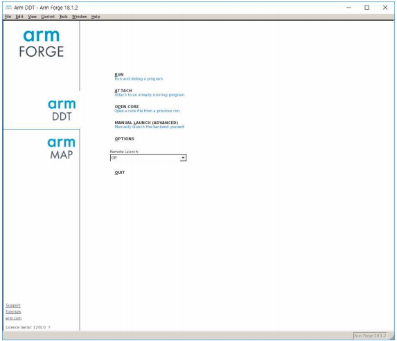
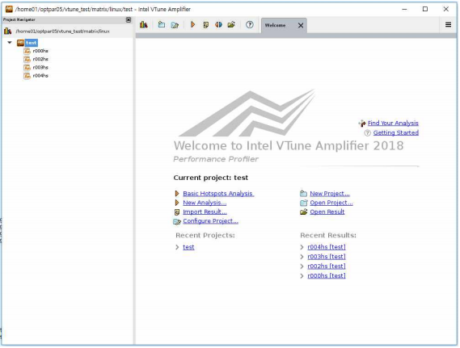
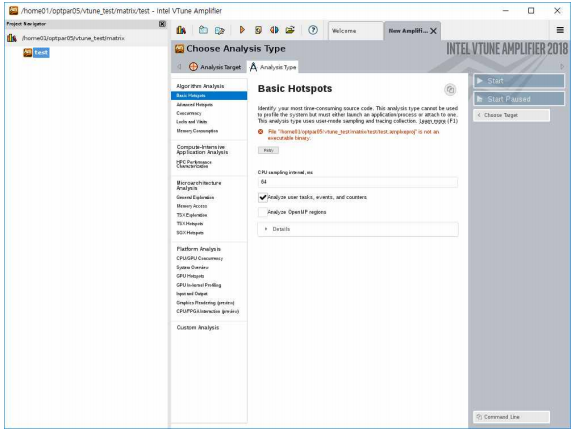
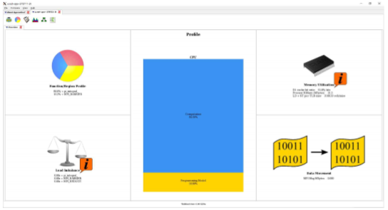
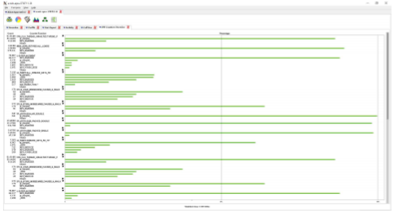

# User Programming Environment

## A. Programming Tool Installation Status

ㅇ Compiler and library module

| **Category**                                 | **Item (Name/Version)**                                                                                                                                                                                                                                                     |                                                                                                                                                                                                                                                                            |
| -------------------------------------------- | --------------------------------------------------------------------------------------------------------------------------------------------------------------------------------------------------------------------------------------------------------------------------- | -------------------------------------------------------------------------------------------------------------------------------------------------------------------------------------------------------------------------------------------------------------------------- |
| <p>Architecture</p><p>distinction module</p> | <p>∙ craype-mic-knl</p><p>∙ craype-network-opa</p>                                                                                                                                                                                                                          | ∙ craype-x86-skylake                                                                                                                                                                                                                                                       |
| Compiler                                     | <p>∙ intel/17.0.5</p><p>∙ intel/18.0.1</p><p>∙ intel/18.0.3</p><p>∙ intel/19.0.1</p><p>∙ intel/19.0.4</p><p>∙ intel/19.0.5</p>                                                                                                                                              | <p>∙ cce/8.6.3</p><p>∙ gcc/6.1.0</p><p>∙ gcc/7.2.0</p><p>∙ gcc/8.3.0</p><p>∙ pgi/18.10</p><p>∙ pgi/19.1</p>                                                                                                                                                                |
| <p>Compiler dependent</p><p>library</p>      | <p>∙ hdf4/4.2.13</p><p>∙ hdf5/1.10.2</p><p>∙ lapack/3.7.0</p><p>∙ ncl/6.7.0</p>                                                                                                                                                                                             | <p>∙ ncview/2.1.7</p><p>∙ NCO/4.7.4</p><p>∙ netcdf/4.6.1</p>                                                                                                                                                                                                               |
| MPI                                          | <p>∙ impi/17.0.5</p><p>∙ impi/18.0.1</p><p>∙ impi/18.0.3</p><p>∙ impi/19.0.1</p><p>∙ impi/19.0.4</p><p>∙ impi/19.0.5</p>                                                                                                                                                    | <p>∙ mvapich2/2.3</p><p>∙ mvapich2/2.3.1</p><p>∙ openmpi/3.1.0</p><p>∙ mvapich-verbs/2.2.ddn1.4</p><p>∙ ime/mvapich-verbs/2.2.ddn1.4</p>                                                                                                                                   |
| <p>MPI dependent</p><p>library</p>           | <p>∙ fftw_mpi/2.1.5</p><p>∙ fftw_mpi/3.3.7</p><p>∙ hdf5-parallel/1.10.2</p>                                                                                                                                                                                                 | <p>∙ netcdf-hdf5-parallel/4.6.1</p><p>∙ parallel-netcdf/1.10.0</p><p>∙ pio/2.3.1</p>                                                                                                                                                                                       |
| Commercial software                          | <p>∙ cfx/v145</p><p>∙ cfx/v170</p><p>∙ cfx/v181</p><p>∙ cfx/v191</p><p>∙ cfx/v192</p><p>∙ cfx/v195</p><p>∙ cfx/v201</p><p>∙ cfx/v202</p><p>∙ fluent/v145</p><p>∙ fluent/v170</p><p>∙ fluent/v181</p>                                                                        | <p>∙ fluent/v191</p><p>∙ fluent/v192</p><p>∙ fluent/v195</p><p>∙ fluent/v201</p><p>∙ fluent/v202</p><p>∙ gaussian/g16.a03</p><p>∙ gaussian/g16.a03.linda</p><p>∙ gaussian/g16.b01.linda</p><p>∙ gaussian/g16.c01.linda</p>                                                 |
| Application software                         | <p>∙ cp2k/5.1.0</p><p>∙ cp2k/6.1.0</p><p>∙ ferret/7.4.3</p><p>∙ forge/18.1.2</p><p>∙ grads/2.2.0</p><p>∙ gromacs/2016.4</p><p>∙ gromacs/2018.6</p><p>∙ gromacs/2020.2</p><p>∙ gromacs/5.0.6</p><p>∙ lammps/12Dec18</p><p>∙ lammps/8Mar18</p>                                | <p>∙ namd/2.12</p><p>∙ namd/2.13</p><p>∙ PETSc/3.8.4</p><p>∙ python/2.7.15</p><p>∙ python/3.7</p><p>∙ qe/6.1</p><p>∙ qe/6.4.1</p><p>∙ R/3.5.0</p><p>∙ siesta/4.0.2</p><p>∙ siesta/4.1-b3</p>                                                                               |
| Virtualization module                        | <p>∙ singularity/3.0.1</p><p>∙ singularity/3.6.4</p>                                                                                                                                                                                                                        | <p>∙ conda/pytorch_1.0</p><p>∙ conda/tensorflow_1.13</p><p>∙ conda/intel_caffe_1.1.5</p>                                                                                                                                                                                   |
| <p>Intel</p><p>Debugging module</p>          | <p>∙ advisor/17.0.5</p><p>∙ advisor/18.0.1</p><p>∙ advisor/18.0.3</p><p>∙ advisor/18.0.3a</p>                                                                                                                                                                               | <p>∙ vtune/17.0.5</p><p>∙ vtune/18.0.1</p><p>∙ vtune/18.0.2</p><p>∙ vtune/18.0.3</p>                                                                                                                                                                                       |
| Cray module                                  | <p>∙ cdt/17.10</p><p>∙ cray-ccdb/3.0.3</p><p>∙ cray-cti/1.0.6</p><p>∙ cray-fftw/3.3.6.2</p><p>∙ cray-fftw_impi/3.3.6.2</p><p>∙ cray-impi/1.1.4</p><p>∙ cray-lgdb/3.0.7</p><p>∙ cray-libsci/17.09.1</p><p>∙ craype/2.5.13</p><p>∙ craypkg-gen/1.3.5</p><p>∙ chklimit/1.0</p> | <p>∙ vapich2_cce/2.2rc1.0.3_noslurm</p><p>∙ vapich2_gnu/2.2rc1.0.3_noslurm</p><p>∙ papi/5.5.1.3</p><p>∙ perftools/6.5.2</p><p>∙ perftools-bas/6.5.2</p><p>∙ perftools-lite/6.5.2</p><p>∙ PrgEnv-cray/1.0.2</p><p>∙ libfabric/1.7.0</p><p>∙ pbs/trace</p><p>∙ pbs/tools</p> |
| Others                                       | <p>∙ cmake/3.12.3</p><p>∙ cmake/3.17.4</p><p>∙ common/memkind-1.9.0</p><p>∙ git/1.8.3.4</p><p>∙ IGPROF/5.9.16</p>                                                                                                                                                           | <p>∙ ImageMagick/7.0.8-20</p><p>∙ perl/5.28.1</p><p>∙ qt/4.8.7</p><p>∙ qt/5.9.6</p><p>∙ subversion/1.7.19</p><p>∙ subversion/1.9.3</p>                                                                                                                                     |

ㅇ Commercial software information


※ For Gaussian, obtain permission for use from the helpdesk account manager ([account@ksc.re.kr](mailto:account@ksc.re.kr)) first

※ Refer to \[Annex 5] for the installation status of shared libraries (e.g.: cairo, expat, jasper, libpng, udunits, etc.)

## B. How to Use Compiler

1\) Compiler and MPI configuration settings (modules)

(1) Default required module

\- One corresponding module must be added to the computing node being used.

| **Computing node to be used** | **KNL**        | **SKL**            |
| ----------------------------- | -------------- | ------------------ |
| Module name                   | craype-mic-knl | craype-x86-skylake |

```
$ module load craype-mic-knl
or
$ module load craype-x86-skylake
```

(2) Basic commands related to the module

▶ Print a list of available modules

A list of modules that are available such as compiler and library can be checked.

```
$ module avail
or
$ module av
```

▶ Add a module to be used

Modules to be used such as compiler and library can be added.

All modules to be used can be added at once.

```
$ module load [module name] [module name] [module name] … 
or
$ module add [module name] [module name] [module name] …
```

▶ Delete modules being used

Remove the modules that are no longer needed. Multiple modules can be deleted at once.

```
$ module unload [module name] [module name] [module name] ... or $ module rm [module name] [module name] [module name] ...
```

▶ Print a list of modules being used.

A list of currently set modules can be checked.

```
$ module list 
or 
$ module li
```

▶ Purge all modules being used

```
$ module purge
```

※ In this case, the default required modules are also deleted at once; those modules need to be added again when reusing them.

2\) Compiling sequential programs

A sequential program refers to a program in which a parallel program environment is not considered. Specifically, it is a program that does not use a parallel program interface such as OpenMP or MPI and is not used where the program is executed using one processor in one node. Options per compiler used for compiling a sequential program are also used when compiling a parallel program; thus, it is recommended to reference them even if a sequential program is not of interest.

**① Intel compiler**

A version of an Intel compiler module required for using the Intel compiler should be added. Available modules can be checked with the command module avail.

```
$ module load intel/18.0.3
```

※ Check the available version by referring to the programming tool installation status table.

■ Compiler type

| **Compiler** | **program** | **Source extensions**                                  |
| ------------ | ----------- | ------------------------------------------------------ |
| icc / icpc   | C / C++     | .C, .cc, .cpp, .cxx,.c++                               |
| ifort        | F77/F90     | .f, .for, .ftn, .f90, .fpp, .F, .FOR, .FTN, .FPP, .F90 |

■ Compiler option

| **Compiler option**                         | **Description**                                                                                                                                                                   |
| ------------------------------------------- | --------------------------------------------------------------------------------------------------------------------------------------------------------------------------------- |
| -O\[1\|2\|3]                                | Object optimization. Optimization level for numbers.                                                                                                                              |
| -ip, ipo                                    | Optimization between procedures                                                                                                                                                   |
| -qopt\_report=\[0\|1\|2\|3\|4]              | Adjusts the amount of vector diagnostic information                                                                                                                               |
| <p>-xCORE-AVX512<br>-xMIC-AVX512</p>        | <p>Supports CPU with a 512 bit register (when the SKL node is used for computing)<br>Supports MIC with a 512 bit register (when the KNL node is used for computing)</p>           |
| -fast                                       | -O3 -ipo -no-prec-div -static, -fp-model fast=2 macro                                                                                                                             |
| <p>-static/-static-intel/<br>-i_static</p>  | Does not allow shared libraries to be linked                                                                                                                                      |
| <p>-shared/-shared-intel/<br>-i_dynamic</p> | Allows shared libraries to be linked                                                                                                                                              |
| -g -fp                                      | Generates debugging information                                                                                                                                                   |
| -qopenmp                                    | Uses OpenMP-based multi-thread code                                                                                                                                               |
| -openmp\_report=\[0\|1\|2]                  | Adjusts OpenMP parallelization diagnostic level                                                                                                                                   |
| <p>-ax<br>-axS</p>                          | <p>Generates code optimized for a specific processor<br>Generates specialized code utilizing the SIMD Extensions4 (SSE4) vectorizing compiler and media acceleration commands</p> |
| -tcheck                                     | Activates the analysis of thread-based programs                                                                                                                                   |
| -pthread                                    | Adds the pthread library to receive multi-threading support                                                                                                                       |
| -msse<3,4.1>,-msse3                         | Supports Streaming SIMD Extensions 3                                                                                                                                              |
| -fPIC,fpic                                  | Compiles to be position independent code (PIC)                                                                                                                                    |
| -p                                          | Generates profiling information (gmon.out)                                                                                                                                        |
| -unroll                                     | Unroll activation, is the maximum number (only supports 64 bit)                                                                                                                   |
| -mcmodel medium                             | Used when a memory allocation of 2 GB or higher is required                                                                                                                       |
| -help                                       | Outputs a list of options                                                                                                                                                         |

■ Example of using Intel compiler

The following is an example of creating an execution file test.exe by compiling a test sample file with the Intel compiler in the **KNL computing node**.

<pre><code><strong> $ module load craype-mic-knl intel/18.0.3
</strong> $ icc –o test.exe –O3 –fPIC –xMIC-AVX512 test.c
 or
 $ ifort -o test.exe -O3 -fPIC -xMIC-AVX512 test.f90
 $ ./test.exe</code></pre>

※ Copy the test sample file for job submission in /apps/shell/home/job\_examples

■ Recommended options

| **Computing node** | **Recommended options**   |
| ------------------ | ------------------------- |
| SKL                | -O3 –fPIC –xCORE-AVX512   |
| KNL                | -O3 -fPIC -xMIC-AVX512    |
| SKL & KNL          | -O3 –fPIC -xCOMMON-AVX512 |

**② GNU compiler**

Add a GNU compiler module required for using the GNU compiler. Available modules can be checked with the command module avail.

```
$ module load gcc/7.2.0
```

※ Check the available version by referring to the programming tool installation status table.

※ Must use "gcc/6.1.0” version or higher

■ Compiler type

| **Compiler** | **program** | **Source extensions**                                  |
| ------------ | ----------- | ------------------------------------------------------ |
| gcc / g++    | C / C++     | .C, .cc, .cpp, .cxx,.c++                               |
| gfortran     | F77/F90     | .f, .for, .ftn, .f90, .fpp, .F, .FOR, .FTN, .FPP, .F90 |

■ GNU compiler option

| **Compiler option**                        | **Description**                                                                                                                                                         |
| ------------------------------------------ | ----------------------------------------------------------------------------------------------------------------------------------------------------------------------- |
| -O\[1\|2\|3]                               | Object optimization. Optimization level for numbers.                                                                                                                    |
| <p>-march=skylake-avx512<br>-march=knl</p> | <p>Supports CPU with a 512 bit register (when the SKL node is used for computing)<br>Supports MIC with a 512 bit register (when the KNL node is used for computing)</p> |
| -Ofast                                     | -O3 -ffast-math macro                                                                                                                                                   |
| -funroll-all-loops                         | Unrolls all loops                                                                                                                                                       |
| -ffast-math                                | Uses a fast floating point model                                                                                                                                        |
| -mline-all-stringops                       | Allows more inlining and improves the performance of memcpy, strlen, and memsetdp dependent codes                                                                       |
| -fopenmp                                   | Uses OpenMP-based multi-thread code                                                                                                                                     |
| -g                                         | Generates debugging information                                                                                                                                         |
| -pg                                        | Generates profiling information (gmont.out)                                                                                                                             |
| -fPIC                                      | Compiles to generate position independent code (PIC)                                                                                                                    |
| -help                                      | Outputs a list of options                                                                                                                                               |

■ Example of using GNU compiler

The following is an example of creating an execution file test.exe by compiling a test sample file with the GNU compiler in the **KNL computing node**.

```
$ module load craype-mic-knl gcc/7.2.0
$ gcc –o test.exe -O3 -fPIC -march=knl test.c
or
$ gfortran –o test.exe -O3 -fPIC -march=knl test.f90
$ ./test.exe
```

※ Copy the test sample file for job submission in /apps/shell/home/job\_examples

■ Recommended options

| **Computing node** | **Recommended options**         |
| ------------------ | ------------------------------- |
| SKL                | -O3 -fPIC -march=skylake-avx512 |
| KNL                | -O3 -fPIC -march=knl            |
| SKL & KNL          | -fPIC -mpku                     |

\*\*\*\*

\*\*\*\*

**③ PGI compiler**

Add a PGI compiler module version required for using the PGI compiler to be used. Available modules can be checked with the command module avail.

```
$ module load pgi/18.10
```

※ Check the available version by referring to the programming tool installation status table.

■ Compiler type

| **Compiler** | **program** | **Source extensions**                                  |
| ------------ | ----------- | ------------------------------------------------------ |
| pgcc / pgc++ | C / C++     | .C, .cc, .cpp, .cxx, .c++                              |
| pgfortran    | F77/F90     | .f, .for, .ftn, .f90, .fpp, .F, .FOR, .FTN, .FPP, .F90 |

■ PGI compiler option

| **Compiler option**                                     | **Description**                                                                                                                                                                                                                                                                                                                                               |
| ------------------------------------------------------- | ------------------------------------------------------------------------------------------------------------------------------------------------------------------------------------------------------------------------------------------------------------------------------------------------------------------------------------------------------------- |
| -O\[1\|2\|3\|4]                                         | Object optimization. Optimization level for numbers.                                                                                                                                                                                                                                                                                                          |
| -Mipa=fast                                              | Optimization between procedures                                                                                                                                                                                                                                                                                                                               |
| -fast                                                   | -O2 -Munroll=c:1 -Mnoframe -Mlre –Mautoinline macro                                                                                                                                                                                                                                                                                                           |
| -fastsse                                                | Optimization supporting SSE and SSE2                                                                                                                                                                                                                                                                                                                          |
| -g, -gopt                                               | Generates debugging information                                                                                                                                                                                                                                                                                                                               |
| -mp                                                     | Uses OpenMP-based multi-thread code                                                                                                                                                                                                                                                                                                                           |
| -Minfo=mp, ipa                                          | OpenMP related information, optimization between procedures                                                                                                                                                                                                                                                                                                   |
| -pg                                                     | Generates profiling information (gmon.out)                                                                                                                                                                                                                                                                                                                    |
| <p>-Mprof=time</p><p>-Mprof=func</p><p>-Mprof=lines</p> | <p>Generates PGPROF output file</p><p>- Frequently used for generating profiling information at the time-based command level</p><p>- Generates profiling information at the function level</p><p>- Generates profiling information at the line level</p><p>(- for Mprof=lines, computing time can be significantly slow owing to an increase in overhead)</p> |
| -mcmodel medium                                         | Used when a memory allocation of 2 GB or higher is required                                                                                                                                                                                                                                                                                                   |
| <p>-tp=skylake</p><p>-tp=knl</p>                        | <p>Option exclusive for the Skylake architecture processor</p><p>Option exclusive for the KNL architecture processor</p>                                                                                                                                                                                                                                      |
| -fPIC                                                   | Compiles to generate position independent code (PIC)                                                                                                                                                                                                                                                                                                          |
| -help                                                   | Outputs a list of options                                                                                                                                                                                                                                                                                                                                     |

■ Example of using PGI compiler

The following is an example of creating an execution file test.exe by compiling a test sample file with the PGI compiler in the **KNL computing node**.

```
$ module load craype-mic-knl pgi/18.10
$ pgcc –o test.exe -fast –tp=knl test.c
or
$ pgfortran –o test.exe -fast –tp=knl test.f90
$ ./test.exe
```

※ Copy the test sample file for job submission in /apps/shell/home/job\_examples

■ Recommended options

| **Computing node** | **Recommended options** |
| ------------------ | ----------------------- |
| SKL                | -fast –tp=skylake       |
| KNL                | -fast –tp=knl           |
| SKL & KNL          | -fast –tp=skylake,knl   |

**④ Cray compiler**

Add a Cray compiler module version required for using the Cray compiler to be used. Available modules can be checked with the command module avail.

```
$ module load cce/8.6.3
```

※ Check the available version by referring to the programming tool installation status table.

■ Compiler type

| **Compiler** | **program** | **Source extensions**                                  |
| ------------ | ----------- | ------------------------------------------------------ |
| cc / CC      | C / C++     | .C, .cc, .cpp, .cxx,.c++                               |
| ftn          | F77/F90     | .f, .for, .ftn, .f90, .fpp, .F, .FOR, .FTN, .FPP, .F90 |

■ Compiler option

| **Compiler option**  | **Description**                                                              |
| -------------------- | ---------------------------------------------------------------------------- |
| -O\[1\|2\|3]         | Object optimization. Optimization level for numbers.                         |
| -hcpu=mic-knl        | Supports MIC with a 512 bit register                                         |
| -Oipa\[0             | 1                                                                            |
| -hunroll\[0\|1\|2]   | Unrolling option. Unrolls all loops if Default is 2                          |
| -hfp\[0\|1\|2\|3\|4] | Floating\_Point optimization                                                 |
| -homp(default)       | Uses OpenMP-based multi-thread code                                          |
| -g \| -G0            | Generates debugging information                                              |
| -h pic               | Used when a static memory of 2 GB or higher is required (used with -dynamic) |
| -dynamic             | Links shared libraries                                                       |

■ Example of using Cray compiler

The following is an example of creating an execution file test.exe by compiling a test sample file with the PGI compiler in the **KNL computing node**.

```
 $ module load craype-mic-knl cce/8.6.3 PrgEnv-cray/1.0.2
 $ cc –o test.exe –hcpu=mic-knl test.c
 or
 $ ftn –o test.exe –hcpu=mic-knl test.f90
 $ ./test.exe
```

※ Copy the test sample file for job submission in /apps/shell/home/job\_examples

■ Recommended options

| **Computing node** | **Recommended options** |
| ------------------ | ----------------------- |
| SKL                | Default value           |
| KNL                | -hcpu=mic-knl           |
| SKL & KNL          | Default value           |

※ test.c and test.f90 for testing can be found in **/apps/shell/home/job\_examples** (test by copying to the user directory)

※ For programs to use the KNL optimization option, it is recommended to access them through interactive job submission by the KNL debug node and then compile (refer to “Job execution through scheduler → B. Job submission monitoring → 2) Interactive job submission”).

3\) Compiling parallel programs

(1) OpenMP compile

OpenMP is a technique simply developed to enable multi-thread utilization only by a compiler directive. A compiler used for compiling parallel programs using OpenMP is the same as that of sequential programs. A compiler option can be added for parallel compilation, and most compilers currently support the OpenMP directive.

| **Compiler option**      | **Program**       | **Option** |
| ------------------------ | ----------------- | ---------- |
| icc / icpc / ifort       | C / C++ / F77/F90 | -qopenmp   |
| gcc / g++ / gfortran     | C / C++ / F77/F90 | -fopenmp   |
| cc / CC /ftn             | C / C++ / F77/F90 | -homp      |
| pgcc / pgc++ / pgfortran | C / C++ / F77/F90 | -mp        |

① Example of OpenMP program compilation (Intel compiler)

The following is an example of creating an execution file test\_omp.exe by compiling a test\_omp sample file that uses OpenMP with the Intel compiler in the **KNL computing node**.

```
$ module load craype-mic-knlintel/18.0.3
$ icc -o test_omp.exe -qopenmp -O3 -fPIC –xMIC-AVX512 test_omp.c
or
$ ifort -o test_omp.exe -qopenmp -O3 -fPIC –xMIC-AVX512 test_omp.f90
$ ./test_omp.exe
```

② Example of OpenMP program compilation (GNU compiler)

The following is an example of creating an execution file test\_omp.exe by compiling a test\_omp sample file that uses OpenMP with the GNU compiler in the **KNL computing node**.

```
$ module load craype-mic-knl gcc/7.2.0
$ gcc -o test_omp.exe -fopenmp -O3 -fPIC -march=knl test_omp.c
or
$ gfortran -o test_omp.exe -fopenmp -O3 -fPIC -march=knl test_omp.f90
$ ./test_omp.exe
```

③ Example of OpenMP program compilation (PGI compiler)

The following is an example of creating an execution file test\_omp.exe by compiling a test\_omp sample file that uses OpenMP with the PGI compiler in the **KNL computing node**.

```
$ module load craype-mic-knl pgi/18.10
$ pgcc –o test_omp.exe -mp -fast test_omp.c
or
$ pgfortran –o test_omp.exe -mp -fast test_omp.f90
$ ./test_omp.exe
```

④ Example of OpenMP program compilation (Cray compiler)

The following is an example of creating an execution file test\_omp.exe by compiling a test\_omp sample file that uses OpenMP with the Cray compiler in the **KNL computing node**.

```
$ module load craype-mic-knl cce/8.6.3 PrgEnv-cray/1.0.2
$ cc -o test_omp.exe -homp -hcpu=mic-knl test_omp.c
or
$ ftn -o test_omp.exe -homp -hcpu=mic-knl test_omp.f90
$ ./test_omp.exe
```

(2) MPI compiler

Users can execute the MPI commands in the following table, and these commands are a type of wrapper where a designated compiler compiles the source through .bashrc.

| **Category**  | **Intel** | **GNU**  | **PGI**   | **Cray** |
| ------------- | --------- | -------- | --------- | -------- |
| Fortran       | ifort     | gfortran | pgfortran | ftn      |
| Fortran + MPI | mpiifort  | mpif90   | mpif90    | ftn      |
| C             | icc       | gcc      | pgcc      | cc       |
| C + MPI       | mpiicc    | mpicc    | mpicc     | cc       |
| C++           | icpc      | g++      | pgc++     | CC       |
| C++ + MPI     | mpiicpc   | mpicxx   | mpicxx    | CC       |

Even when compiled through mpicc, the options corresponding to the original compiler being wrapped must be used.

\*\*\*\*

**①** Example of MPI program compilation (Intel compiler)

The following is an example of creating an execution file test\_mpi.exe by compiling a test\_mpi sample file that uses MPI with the Intel compiler in the **KNL computing node**.

```
$ module load craype-mic-knl intel/18.0.3 impi/18.0.3
$ mpiicc -o test_mpi.exe -O3 -fPIC -xMIC-AVX512 test_mpi.c
or
$ mpiifort -o test_mpi.exe -O3 -fPIC -xMIC-AVX512 test_mpi.f90
$ mpirun -np 2 ./test_mpi.exe
```

**②** Example of MPI program compilation (GNU compiler)

The following is an example of creating an execution file test\_mpi.exe by compiling a test\_mpi sample file that uses MPI with the GNU compiler in the **KNL computing node**.

```
$ module load craype-mic-knl gcc/7.2.0 openmpi/3.1.0
$ mpicc -o test_mpi.exe -O3 -fPIC -march=knl test_mpi.c
or
$ mpif90 -o test_mpi.exe -O3 -fPIC -march=knl test_mpi.f90
$ mpirun -np 2 ./test_mpi.exe
```

**③** Example of MPI program compilation (PGI compiler)

The following is an example of creating an execution file test\_mpi.exe by compiling a test\_mpi sample file that uses MPI with the PGI compiler in the **KNL computing node**.

```
$ module load craype-mic-knl pgi/18.10 openmpi/3.1.0
$ mpicc -o test_mpi.exe -O3 -fPIC -tp=knl test_mpi.c
or
$ mpifort -o test_mpi.exe -O3 -fPIC -tp=knl test_mpi.f90
$ mpirun -np 2 ./test_mpi.exe
```

**④** Example of MPI program compilation (Cray compiler)

The following is an example of creating an execution file test\_mpi.exe by compiling a test\_mpi sample file that uses MPI with the Cray compiler in the **KNL computing node**.

```
$ module load craype-mic-knl cce/8.6.3 PrgEnv-cray/1.0.2
$ cc -o test_mpi.exe -hcpu=mic-knl test_mpi.c
or
$ ftn -o test_mpi.exe -hcpu=mic-knl test_mpi.f90
$ mpirun -np 2 ./test_mpi.exe
```

## C. Debugger and Profiler

\
The 5th supercomputer Nurion beta service provides DDT for program debugging by users. Furthermore, two profilers, namely Intel vtune and CaryPat, are provided for the program profiling of users.

1\) Example of using debugger DDT\
\- Select the architecture, compiler, and MPI to be used for using DDT in the 5th supercomputer, and then select a module for using DDT.

```
$ module load craype-mic-knl or craype-x86-skylake
$ module load intel/17.0.5 impi/17.0.5
$ module load forge/18.1.2
```

\- This example was tested in the identical environment as above.

\- Select an execution file by adding the -g -O0 option when compiling as preparation before using DDT.

```
$ mpiicc -o test.x -g -O0 test.c
```

\- After running xming and completing the settings of the SSH X environment on a user’s desktop, execute the DDT execution command.

```
$ ddt &
```

\- Execute the command to see if the following pop-up execution window appears.



\- Select “RUN” among the listed commands, select the file for debugging as shown below, and then click “RUN” in the new pop-up window.


\- Debugging can be initiated by entering the debugging mode for the following selected execution file.


2\) Example of using profiler Intel vtune Amplifier\
Select the architecture, compiler, and MPI for using a profiler vtune in this system, and then select vtune to use the profiler.

```
$ module load craype-mic-knl or craype-x86-skylake
$ module load intel/17.0.5 impi/17.0.5
$ module load vtune/17.0.5
```

This example was tested in an identical environment as above.

ㅇ How to use CLI\
\- The command for executing the Intel vtune Amplifier in CLI mode is as follows.

```
$ Executing a program for analyzing the amplxe-cl option
```

```
$ amplxe-cl -collect hotspots /home01/$USER/test/test.x
 
 amplxe: Using result path '/home01/$USER/test/r000hs'
 amplxe: Executing actions 75% Generating a report
 Function CPUTime CPUTime:EffectiveTime CPUTime:EffectiveTime:Idle
 CPUTime:EffectiveTime:Poor CPUTime:EffectiveTime:Ok CPUTime:EffectiveTime:Ideal
 CPUTime:EffectiveTime:Over CPUTime:SpinTime CPUTime:OverheadTime Module Function(full)
 SourceFile StartAddress
  
 multiply1 21.568s 0.176s 21.392s 0s 0s 0s 0s martix.mic multiply1 multiply.c
 0x401590
 init_arr 0.020s 0s 0.020s 0s 0s 0s 0s matrix.mic init_arr matrix.c
 0x402384
 amplx: Executing actions 100% done
```

\- If a compiled execution file is prepared and executed according to the command, the r000hs directory is generated. After confirming that the directory has been generated, the command for generating a report is executed to output the result shown below.

```
$ amplxe-cl -report hotspots /home01/$USER/debugger/test/r000hs
 amplxe: Using result path `/home01/$USER/debugger/test/r000hs'
 amplxe: Executing actions 75 % Generating a report Function CPU Time CPU Time:Effective Time CPU Time:Spin Time CPU Time:Overhead Time Module Function (Full) Source File Start Address
 -------- -------- ----------------------- ------------------ ---------------------- ------ --------------- ----------- -------------
 amplxe: Executing actions 100 % done
```

ㅇ How to check the result of using GUI\
\- Intel vtune Amplifier also supports the GUI mode. Only the method for checking the result using GUI is explained here.

\- Run xming on a user’s desktop

```
$ amplxe-gui
```

\- Click “New Analysis” in the screen below.



\- When the screen shown below appears, check the number of CPUs and click the Start button to begin the analysis.



\- Once completed, the analysis results are summarized in multiple tabs as shown below.


.png>)

3\) Example of using profiler Cary-Pat\
The environment including the architecture is set as below for using CaryPat, which is a profiler, and the example was initiated.

```
$ module load craype-mic-knl or craype-x86-skylake
$ module load perftools-base/6.5.2 perftools/6.5.2
$ module load PrgEnv-cray/1.0.2 cce/8.6.3
```

\- First, test.c file to be used in the example is compiled.

```
$ cc test.c
```

\- As a result, an execution file a.out is generated.

\- For analyzing with CaryPat, use pat\_build to generate a new execution file.

```
$ pat_build -0 apa a.out
```

\- As a result, a.out+pat file is generated.

\- The generated execution file is written with MPI; thus, it is executed with mpirun.

```
$ mpirun -np 4 ./a.out+pat
```

\- Once execution is complete, the a.out+pat+378250-3s directory is generated, and the xf-files/002812.xf file is created in the directory.

```
$ pat_report a.out+pat+378250-3s
```

\- When pat\_report is executed as above, .ap2 and .apa files are created in the a.out+pat+378250-3s directory.

```
$ pat_build -0 a.out+pat+378250-3s/build-options.apa
```

\- When the execution file is created again using the .apa file, the file named a.out+apa is created.

\- When the generated a.out+apa file is executed

```
$ mpirun -np 4 ./a.out+apa
```

\- a new xf file is generated in a.out+pat+378250-3t.

\- Reuse pat\_report to process the new data.

```
$ pat_report a.out+apa+378250-3t
```

\- When the file is executed as above, the ap2 file and tracing report are created.

\- app2 is provided as a method for visualizing the collected data.

```
$ app2 a.out+apa+378250-3t
```

\- Visualization results are produced as shown below.



.png>)

.png>)




2022년 2월 15일에 마지막으로 업데이트되었습니다.

